<p align="center">
  
</p>

# Keel

**An open-source B-rep solid modeling kernel in Rust.**

Exact topology decisions over tolerant geometry. A "decline, never wrong" contract on every operation.
Alpha 0.1, APIs change without notice.

<!-- BADGES: CI and crates.io hrefs become live once a remote and a published crate exist. -->
[](https://github.com/keel-kernel/keel/actions)
[](#license)
[](https://crates.io)

---

## At a Glance

The kernel's defining property is a measured error contract, not a feature count:
**every operation either produces a verified result or explicitly declines, and the
"wrong" outcome is held at zero** across every test lane. The figures below are
generated directly from the kernel's own test output by
[`docs/media/render_charts.py`](docs/media/render_charts.py); every number traces to a
numbered addendum in [`LOG.md`](LOG.md).

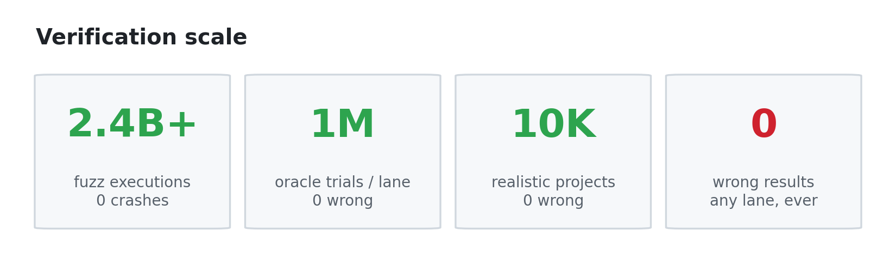

| | |
|---|---|
| 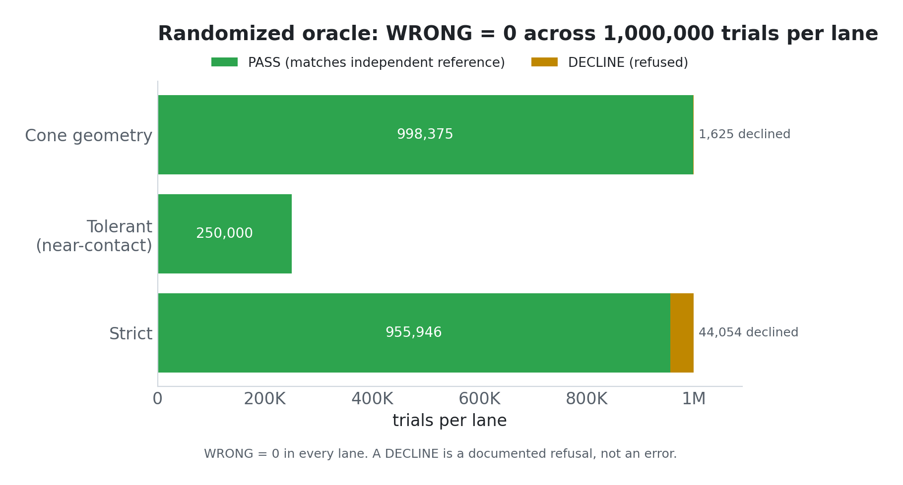 | 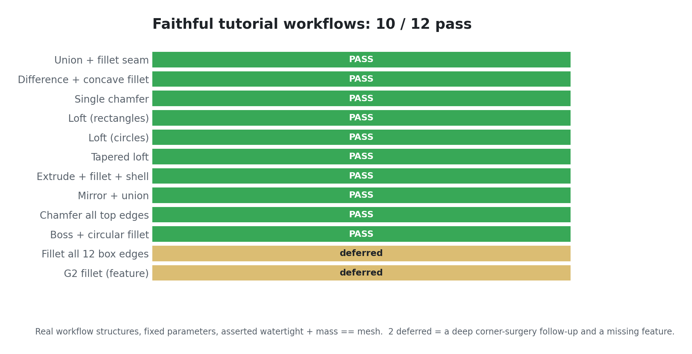 |
| 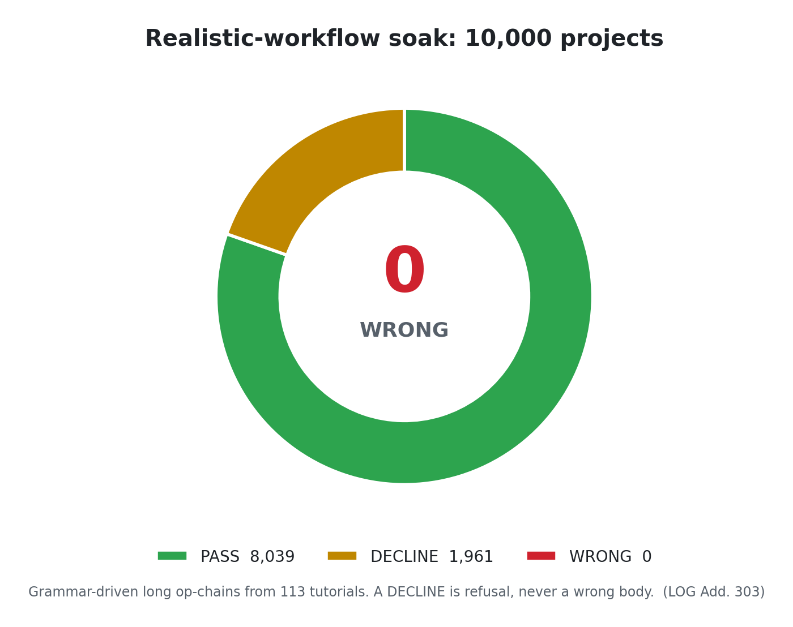 | 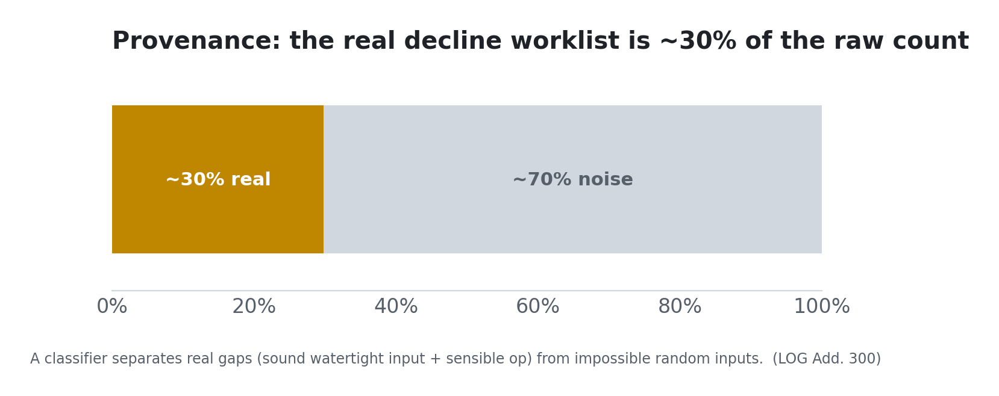 |

These are correctness and coverage figures. Performance benchmarks are deliberately
omitted here until the operation-level benchmark harness lands; no timing numbers are
claimed on this page.

---

## What and Why

Most open B-rep kernels treat topology as a downstream consequence of floating-point geometry.
Keel inverts that: combinatorial topology decisions (which edge bounds which face, which region is inside or outside) are certified
exact using Shewchuk-class predicates and algebraic real arithmetic at branch points,
while metric geometry (coordinates, parameter values) uses `f64` with explicit per-entity tolerances.

The practical consequence is a defined error contract: an operation either produces
a topologically correct result or it explicitly declines. It does not silently produce a wrong answer.
The three-bucket oracle used in randomized testing enforces this: PASS (correct), DECLINE (refused),
WRONG (zero tolerance). WRONG must be zero.

This approach is the consensus recommendation of the research literature on robust computational geometry.
It is not yet widely shipped in open kernels.

---

## Demo Gallery

All animations are rendered directly from Keel's own tessellation output.
Resolution and shading fidelity reflect the kernel's current state, not a rendering budget.

| | | |
|---|---|---|
| 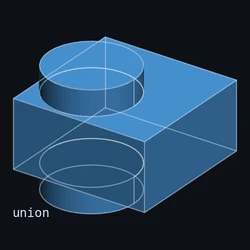 | 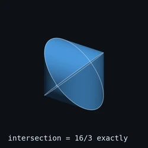 | 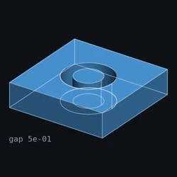 |
| Boolean trio (union / intersect / subtract) | Steinmetz solid (bicylinder intersection) | Clearance-pin assembly boolean |
| 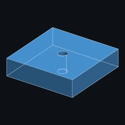 | 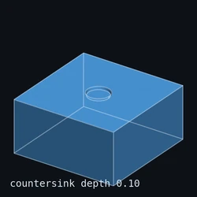 | 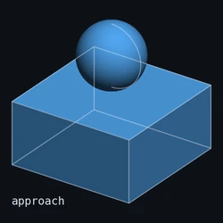 |
| Drill pocket | Countersink | Socket boolean |
| 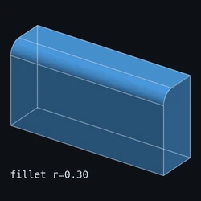 | 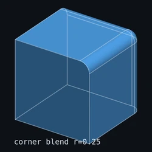 | 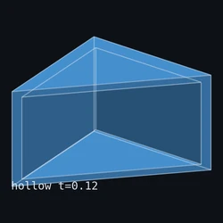 |
| Fillet overflow (graceful degeneracy) | Corner blend | Shell cutaway |
| 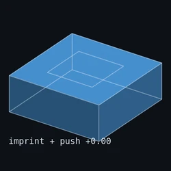 | 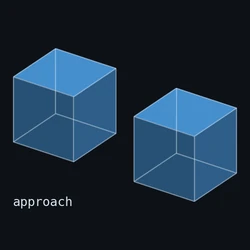 | 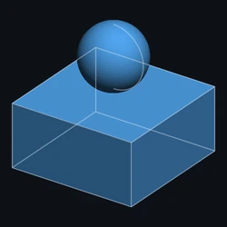 |
| Imprint and push | SGC merge | Honest decline (operation refused, no result) |

<details>
<summary>Full media corpus (remaining demos)</summary>

| | | |
|---|---|---|
| 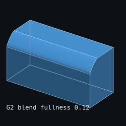 | 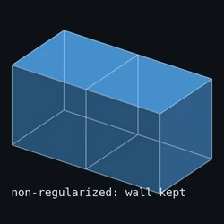 | 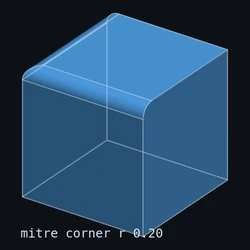 |
| Blend zoo, multiple fillet families side by side | Cellular union, non-manifold result retained | Corner blend variant, second configuration |
| 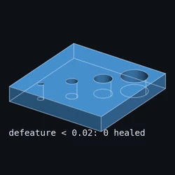 | 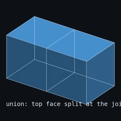 | 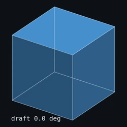 |
| Defeature: round removal | Delete face, heal boundary | Draft angle applied to a pocket |
| 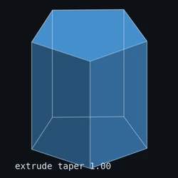 | 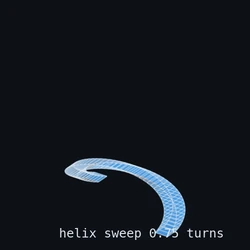 | 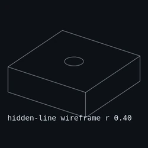 |
| Extrude and revolve primitives | Helix sweep | Hidden-line removal wireframe |
| 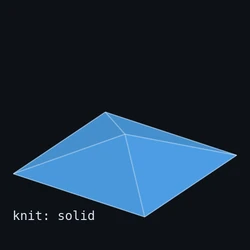 | 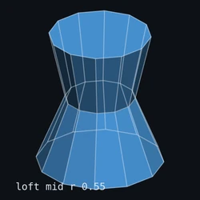 | 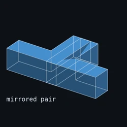 |
| Sheet knit (open shell closure) | Loft between profiles | Mirror operation |
| 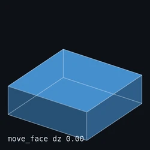 | 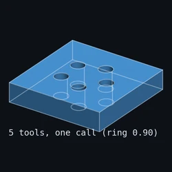 | 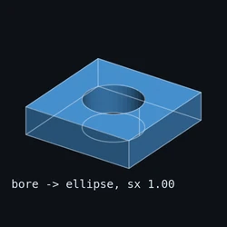 |
| Move-face direct edit | Multi-tool boolean (several cutters) | Non-uniform scaling / non-uniform surface |
| 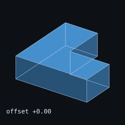 | 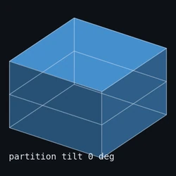 | 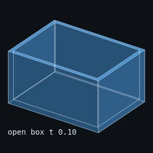 |
| Offset face | Partition body by surface | Pierce (body-through-body) |
| 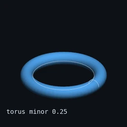 | 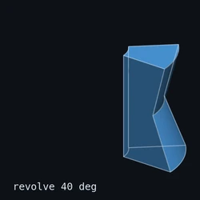 | 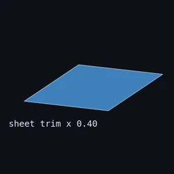 |
| Primitive constructors: box, cylinder, sphere, cone, torus | Partial revolve (sector) | Sheet bodies and open shells |
| 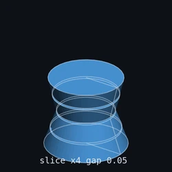 | 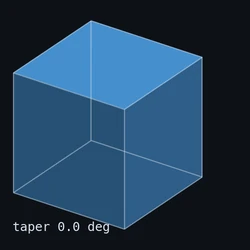 | 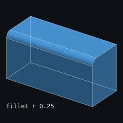 |
| Slice-stack cross-section sweep | Taper face | Unblend (fillet removal) |
| 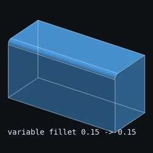 | 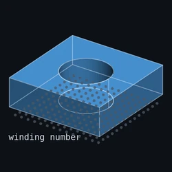 | 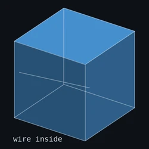 |
| Variable-radius fillet | Generalized winding-number point cloud classification | Wire trim on a face |

</details>

---

## The Honesty Contract

### Decline, never wrong

Every boolean, blend, and local-edit operation returns one of three outcomes:

| Outcome | Meaning |
|---|---|
| **PASS** | A topologically verified result. Mass properties and mesh volume agree to within tessellation error. |
| **DECLINE** | The operation was not attempted or could not be certified. The input body is unchanged. |
| **WRONG** | This outcome is not permitted. The oracle enforces zero occurrences. |

A DECLINE is a first-class, documented result, not a crash. The `honest-decline` demo above shows this in action.

### Randomized oracle testing

Three-bucket correctness is enforced by a large randomized oracle suite.
Each trial generates a random input, runs the operation, and classifies the result:
PASS if output matches an independently computed reference (exact closed form or a separate code path),
DECLINE if the kernel refused, WRONG if the output disagrees with the reference and was not declined.

In the most recent completion-gate run, 1,000,000 randomized trials per lane produced a WRONG
count of 0. The strict lane recorded 955,946 PASS and 44,054 DECLINE; the tolerant
(near-contact) lane recorded 250,000 PASS and 0 DECLINE; a separate cone-geometry lane
recorded 998,375 PASS and 1,625 DECLINE. WRONG was 0 in every lane, matching the earlier
gate run. The DECLINE rate varies by operation class (a strict refusal of sub-tolerance
contact is expected, not a failure) and is documented per operation in the engineering log.

### Mass-mesh self-consistency gate

For every solid result, the kernel computes mass properties from the B-rep (analytic integrals over faces)
and independently from the tessellation (mesh volume via the divergence theorem).
Agreement is a necessary gate before a result is classified PASS: an all-planar result, whose
tessellation is exact, must agree to roughly 1e-9; a curved result must agree to within the
adaptive tessellation's worst chordal deviation (about 2%). This gate is necessary, not
sufficient: it is paired with a coedge-pairing (shell-closure) check so that a dropped face
cannot pass under symmetric volume cancellation.

### Fuzz soak

Fuzz harnesses exercise the kernel's parser, solver, and boolean pipeline continuously.
Findings from fuzzing have historically caught real bugs (overflow in polynomial solvers,
bracket midpoint overflow in Newton iteration, denormal-coefficient edge cases).
The completion-gate soak runs 16 sectors back to back; the most recent run logged over
2.4 billion executions with zero crashes, consistent with a prior soak of similar scale.

---

## Capabilities

For the honest capabilities and **limitations** frontier (the faithful tutorial
scoreboard, the decline taxonomy, what the kernel refuses and why), see
[`docs/CAPABILITIES.md`](docs/CAPABILITIES.md). The matrix below is the
shipped/partial/declined summary.

Legend: **S** = shipped and tested, **P** = partial or in progress, **D** = declined by design (not in scope)

### Boolean operations

| Operation | Status | Notes |
|---|---|---|
| Union, intersect, subtract (planar faces) | **S** | |
| Union, intersect, subtract (cylinder faces) | **S** | Equal-radius crossing cylinders assemble exactly (Steinmetz 16/3) |
| Union, intersect, subtract (cone faces) | **S** | Countersink carve and mated plug exact |
| Union, intersect, subtract (sphere faces) | **S** | Socket carve and ball-in-socket exact |
| Union, intersect, subtract (NURBS faces) | **P** | Certified SSI; general NURBS booleans not yet certified |
| Multi-body (cellular) boolean | **S** | |
| Non-manifold boolean result retention | **S** | First-class regions in topology |

### Blends and fillets

| Operation | Status | Notes |
|---|---|---|
| Constant-radius edge fillet | **S** | |
| Variable-radius fillet | **S** | |
| Corner blend (vertex fillet) | **S** | |
| Fillet overflow / graceful degeneracy | **S** | Documented in `fillet-overflow` demo |
| Chamfer (symmetric and asymmetric) | **S** | |
| Unblend (fillet removal) | **S** | |

### Local direct-edit operations

| Operation | Status | Notes |
|---|---|---|
| Push / pull face | **S** | |
| Draft face | **S** | |
| Taper face | **S** | |
| Move face | **S** | |
| Offset face | **S** | |
| Shell / hollow | **S** | |
| Delete face (heal) | **S** | |
| Defeature (round removal) | **S** | |
| Mirror | **S** | |
| Non-uniform scale (curved bodies) | **S** | Bore becomes a true ellipse via the exact NURBS image |

### Sheets, knit, partition

| Operation | Status | Notes |
|---|---|---|
| Sheet bodies and open shells | **S** | |
| Knit (close open shell) | **S** | |
| Partition body by surface | **S** | |

### Sweeps, lofts, revolves

| Operation | Status | Notes |
|---|---|---|
| Extrude | **S** | |
| Revolve (full and partial) | **S** | |
| Loft between profiles | **S** | |
| Helix sweep | **S** | |
| Wire trim | **S** | |

### Interrogation

| Operation | Status | Notes |
|---|---|---|
| Mass properties (volume, area, centroid, inertia) | **S** | Analytic integrals per face |
| Cross-section slices | **S** | |
| Hidden-line removal wireframe | **S** | |
| Winding-number point-in-solid | **S** | Generalized winding numbers (signed solid angle) |

### Import / export

| Format | Status | Notes |
|---|---|---|
| STEP export | **S** | Analytic surfaces and curves to AP203/214-class entities |
| STEP import | **P** | Quadric surfaces and analytic curves; fuzzed; not yet a full reader |
| WASM build | **P** | `keel-wasm` crate in workspace; spike in progress |

---

## Verification

### Oracle methodology

For each operation class, Keel maintains an independent oracle: a separately derived closed-form
or a second code path that produces a known-good answer for randomly generated inputs.
The boolean oracle uses generalized winding numbers to classify points in the result body.
The mass-properties oracle uses analytic closed forms (for example, the intersection of two equal
perpendicular unit cylinders, the Steinmetz bicylinder, has volume exactly 16/3 with no factor of
pi; the kernel assembles it and integrates to that value to roughly 1e-14) against which the
kernel's numeric integral is compared.

Exact closed-form references remove the need to trust the test itself, a known weakness of
differential-testing oracles.

### Fuzz sectors

Fuzzing is organized into 16 sectors, one harness per subsystem: the boolean pipeline
(`fuzz_boolean`, `fuzz_cyl_boolean`, `fuzz_cone_boolean`, `fuzz_nurbs_boolean`), the imprint
and topology operators (`fuzz_imprint`, `fuzz_topo_ops`), point classification and winding
(`fuzz_pmc`, `fuzz_winding`), surface-surface intersection (`fuzz_ssi`), STEP import
(`fuzz_step_import`), canonical recovery (`fuzz_recover`), NURBS evaluation (`fuzz_nurbs_curve`,
`fuzz_nurbs_surface`), and the numeric layer (`fuzz_bernstein_roots`, `fuzz_interval`,
`fuzz_solve_cubic`).

In the most recent soak each sector ran a fixed time budget; per-sector execution counts ranged
from a few thousand on the heaviest boolean geometry to several hundred million on the numeric
layer, for a soak total over 2.4 billion, with zero crashes. The geometry-heavy sectors are the
slow ones by design (each execution builds and validates a body).

### Demo corpus and op gym

The demo corpus (the `.webp` files in `docs/media/`) doubles as an integration instrument:
each demo is a fixed input/output pair that must survive every refactor.
The op gym is a set of parameterized operation exercises run as part of the test suite.
Together they provide broad coverage of the kernel's surface area at the integration level,
complementing the unit-level oracle tests.

---

## Architecture

For a deeper, source-grounded overview (the radial-edge B-rep data model, the boolean
pipeline stages, the mass integrator, and the correctness architecture), see
[`docs/ARCHITECTURE.md`](docs/ARCHITECTURE.md). The crate summary follows.

### `keel-math`

Numeric foundations: vectors (`Vec2`, `Vec3`, `Vec4`), matrices, transforms (Rodrigues rotation),
axis-aligned bounding boxes, outward-rounded interval arithmetic, tolerance policy
(one home for every epsilon: linear `1e-8`, angular `1e-11`), exact predicates
(Shewchuk `robust` crate behind a `Sign` enum, with the orient3d below-plane convention
documented in unit tests), bracketed hybrid Newton solver, polynomial arithmetic
(Blinn quadratic, Yuksel monotonic-interval cubic), and Bernstein machinery including
the projected-polyhedron multivariate subdivision solver.

The one-root algebraic layer (`OneRoot` numbers of the form (a + b sqrt(c)) / d over exact
integers, compared exactly by the Devillers et al. integer sign-battery recipe, no square
root ever evaluated) supports exact conic predicates at the topology tier.

### `keel-geom`

Curves and surfaces: homogeneous 4D NURBS (de Boor evaluation, hodograph derivatives,
rational recursion, exact circular arcs and full circles, knot insertion / Bezier decomposition),
analytic curves (`Line3`, `Circle3`, `Ellipse3`), analytic surfaces (planes, cylinders, cones,
spheres, tori, surfaces of revolution), local differential geometry (first and second fundamental
forms, principal curvatures, Gaussian and mean curvature), global closest-point projection
(Bezier decompose, AABB branch-and-bound prune, bracketed-Newton polish), and interval enclosures
for certified containment tests.

All evaluators are generic over scalar type to admit interval arithmetic in the certification
pipeline.

### `keel-topo`

PES-class non-manifold B-rep topology with first-class space-partitioning regions, Euler operators
(MEV, MEF, MEKR, KEV, KEF, KEKR and their inverses), operation lineage records on every entity,
session / pmark / rollback support (transactional editing), boolean pipeline (imprint, classify,
stitch), blend and fillet families, local direct-edit operators, tessellation (edge-first watertight
contract), cross-section interrogation, mass-properties integrator, and hidden-line removal.

### `keel-wasm`

Thin WebAssembly binding layer over `keel-topo`. Exposes a subset of the API for browser
and Node.js consumers. Spike in progress; the API surface is not yet stable.

---

## Methodology and References

Keel's approach is the consensus recommendation of the robust computational-geometry
literature: exact (or filtered-exact) combinatorial decisions over tolerant `f64` metric
geometry, validated against exact closed-form references rather than a second approximate
code path. The methods are established; the engineering and the never-wrong integration
are the contribution.

Headline methods, each mapped to the module that uses it: Shewchuk adaptive predicates
(via the `robust` crate); the Devillers et al. exact one-root comparison for conic
intersections; Farouki-Rajan Bernstein arithmetic and the Sherbrooke-Patrikalakis
Projected-Polyhedron system solver; de Boor NURBS evaluation (The NURBS Book); Weiler
radial-edge non-manifold topology with Requicha regularized set operations; and
generalized winding numbers (Jacobson et al.; Van Oosterom-Strackee solid angle) for
point classification.

The complete bibliography, mapped subsystem by subsystem and verified against the source,
is in [`docs/REFERENCES.md`](docs/REFERENCES.md).

---

## Quickstart

### Build and test

```sh
# Requires Rust stable (see rust-toolchain.toml for the pinned version).
cargo build --workspace
cargo test --workspace
cargo clippy --workspace --all-targets -- -D warnings
```

Fuzz harnesses require Linux and Rust nightly:

```sh
# In WSL or a Linux environment:
cargo +nightly fuzz run fuzz_boolean
cargo +nightly fuzz run fuzz_cyl_boolean
cargo +nightly fuzz run fuzz_imprint
```

### Minimal example

```rust
use keel_math::vec::Vec3;
use keel_topo::Body;
use keel_topo::boolean::{BoolOp, boolean};

fn main() {
    // Two overlapping corner-anchored blocks: a = [0,2]^3, b = [1,3]^3.
    let mut a = Body::new();
    a.block(Vec3::ZERO, 2.0, 2.0, 2.0).unwrap();
    let mut b = Body::new();
    b.block(Vec3::new(1.0, 1.0, 1.0), 2.0, 2.0, 2.0).unwrap();

    // Subtract b from a. The result is one of the three outcomes above.
    match boolean(&a, &b, BoolOp::Difference, 1e-7) {
        Ok(result) => {
            // PASS: a certified body. Its volume is 8 (block a) minus 1
            // (the [1,2]^3 overlap) = 7.
            let v = result.body.mass_properties().unwrap().volume;
            println!("difference volume: {v}");
        }
        Err(fault) => {
            // DECLINE: the kernel refused rather than risk a wrong body.
            println!("operation declined: {fault:?}");
        }
    }
}
```

---

## Roadmap

The milestones below follow the sequence established in the architecture spec
(`docs/superpowers/specs/2026-06-07-keel-kernel-architecture-design.md`).
Status is approximate; read `LOG.md` for the current anchor.

| Milestone | Description | Status |
|---|---|---|
| M1 | Numeric foundations (`keel-math`) | Complete |
| M2 | Curves and surfaces (`keel-geom`) | Complete |
| M3 | Topology layer, Euler ops, primitives | Complete |
| M4 | Boolean pipeline, classify, stitch | Complete |
| M5 | Certified SSI (surface-surface intersection), NURBS booleans | Partial: SSI certified and analytic booleans exact; general NURBS booleans not yet certified |
| M6 | Blends, fillets, local direct-edit operators | Complete |
| M7 | STEP import/export, WASM build, first external consumer | Partial: STEP export shipped, import partial, WASM spike, consumer integration ongoing |

Items not on the current roadmap (by design): T-splines (patent landscape, THB-splines cover
the refinement use case), auto-inferred live-rules constraints, single-body mesh-plus-B-rep
convergent operations. See `docs/superpowers/specs/2026-06-07-keel-kernel-architecture-design.md`
section D10 for the patent posture.

---

## License

Keel is free software; you may use, redistribute, and modify it under the terms of the
**GNU General Public License, version 3.0 or later** (`SPDX: GPL-3.0-or-later`), as published
by the Free Software Foundation. See the `LICENSE` file for the complete text.

Alternatively, Keel may be used under the terms of a commercial license or a contractual
agreement.

Keel is provided on an "AS IS" basis, WITHOUT WARRANTY OF ANY KIND. The entire risk related
to any use of the code and materials is on you. See the license text for the formal disclaimer.

---

## A note on the demos

Every animation in this README was rendered from the kernel's own tessellation output,
processed by the `docs/media/render_gif.py` script in this repository.
The geometry you see is exactly what the kernel produces. No external renderer, no cleanup.

---

## Support

If Keel is useful to you, you can support its development:

<a href="https://www.buymeacoffee.com/scottm" target="_blank"></a>
